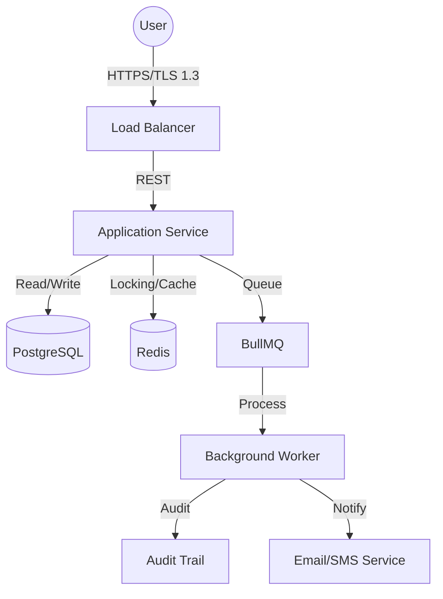
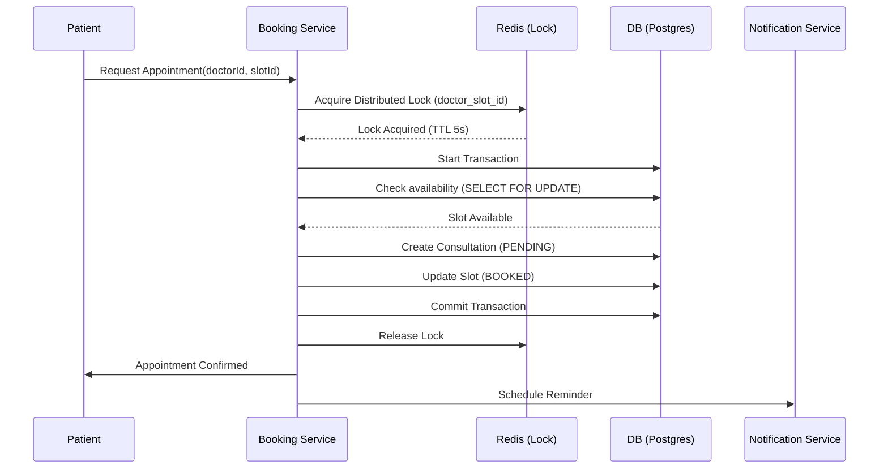

# Amrutam Telemedicine: System Architecture & Design Specification

## 1. High-Level Architecture
The system is built as a mission-critical, high-availability platform designed to handle **100,000 daily consultations**. It utilizes a modular monolith architecture that optimizes for development speed while ensuring sub-millisecond precision for critical workflows.

### System Overview
- **Edge Layer**: AWS CloudFront/ALB for SSL termination and global traffic routing.
- **Application Layer**: Node.js/TypeScript Express services.
- **Data Layer**: 
  - **PostgreSQL**: Primary transactional database.
  - **Redis**: Low-latency cache and distributed lock management.
- **Worker Layer**: BullMQ powered background workers for async processing (Reminders, Reports).

## 2. Core Workflows
### 2.1 Booking Flow & Concurrency Management
To prevent double-booking in a high-concurrency environment (100k+ users), we implement **Distributed Locks** using Redis (Redlock pattern).

## 3. Data Integrity & Reliability
### 3.1 Transaction Management & Sagas
For long-running processes (e.g., Payment -> Consultation -> Prescription), we use **Choreography-based Sagas**. 
- **Atomic Transactions**: Local database transactions ensure `Consultation` and `Slot` updates are all-or-nothing.
- **Compensating Transactions**: If a prescription generation fails after a completed consultation, a background worker triggers a manual review or retry mechanism.

### 3.2 Retry & Backoff Strategy
All external service calls (Email API, SMS, Payment Gateways) implement **Exponential Backoff with Jitter**.
- **Initial Delay**: 500ms
- **Multiplier**: 2x
- **Max Retries**: 5
- **Queueing**: Failed tasks are moved to a `Dead Letter Queue` (DLQ) for manual observability.

## 4. Scalability Strategy
### 4.1 Data Partitioning
To maintain **p95 < 500ms writes** at scale:
- **Vertical Partitioning**: PHI (medical records) is stored in specialized tables.
- **Horizontal Partitioning (Sharding)**: Consultation logs are partitioned by `created_at` (Monthly partitions).
- **Audit Logs**: Moved to a separate Read-Heavy optimized instance if audit volume exceeds 1TB/month.

### 4.2 Caching Strategy
- **Layer 1 (L1)**: In-memory application cache for static configuration.
- **Layer 2 (L2)**: Redis for Session data, Rate Limiting (IP/Token), and cached Doctor Profiles (TTL 10m).

## 5. Security & Compliance
### 5.1 Threat Model
- **Unauthorized Access**: Mitigated via RBAC and JWT (RS256).
- **SQL Injection**: Prevented by Prisma ORM prepared statements.
- **DDoS**: Throttled by Redis-backed Rate Limiter (100 req / 15 min).

### 5.2 Security Checklist
- [x] **Data at Rest**: AES-256 encryption.
- [x] **Data in Transit**: TLS 1.3 enforced.
- [ ] **MFA**: Backend support implemented; front-end TOTP integration pending.
- [x] **Audit Trails**: Immutable logging of every record access.

## 6. Observability
- **Logs**: JSON-formatted logs via Winston (Standard Output).
- **Metrics**: Integrated Prometheus metrics for HTTP request duration and memory usage.
- **Tracing**: Correlation IDs attached to every request to trace flow from ALB to Database.

## 7. Backup & Disaster Recovery (DR)
- **RPO**: 15 Minutes (Via PostgreSQL WAL streaming to replica).
- **RTO**: 1 Hour (Automated failover to secondary AWS region).
- **Backups**: Daily encrypted snapshots stored in immutable S3 buckets with 7-year retention for medical compliance.
