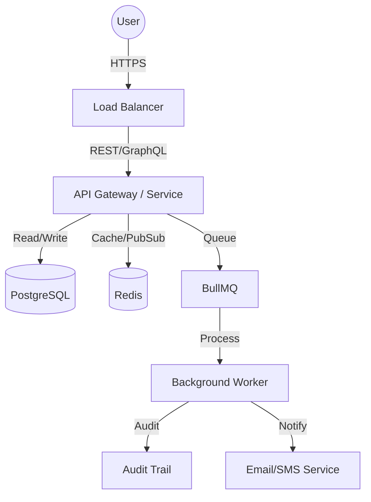
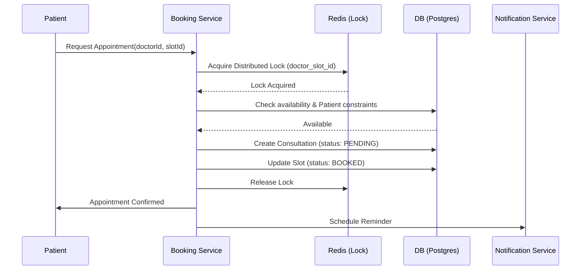
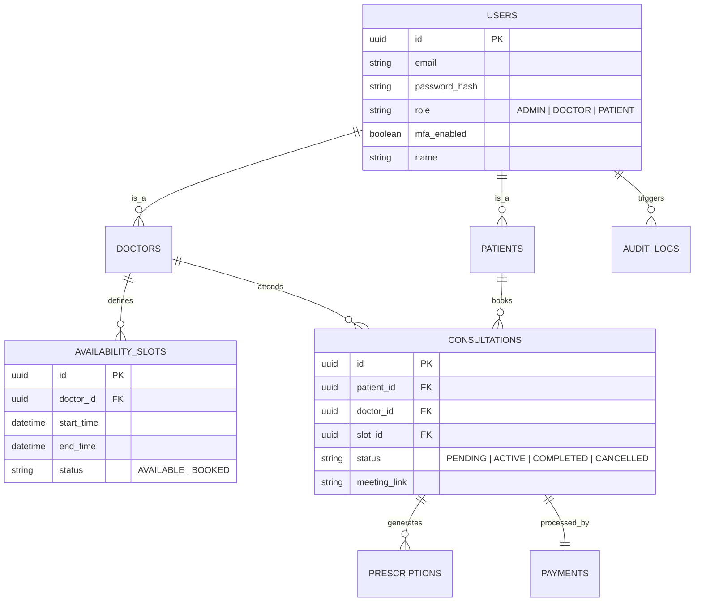

# Amrutam Telemedicine Architecture Document

## 1. High-Level Architecture
The system follows a modular monolith approach (deployable as microservices if needed) with clear separation of concerns.

## 2. Booking Flow Sequence Diagram
Ensures consistency and prevents double-booking.

## 3. Data Model (ERD)
Core entities for telemedicine.

## 4. Scalability & Reliability
- **Data Partitioning**: Consultation and Audit logs will be partitioned by `created_at` (monthly) to maintain performance at 100k daily consultations.
- **Concurrency**: Distributed locks via Redis to handle race conditions during slot bookings.
- **Transaction Management**:
    - **Local**: Database-level transactions for immediate consistency in booking.
    - **Sagas**: Choreography-based sagas for cross-service flows.
- **Prisma 7 & Adapter**:
    - The system uses **Prisma v7** with a specialized `prisma.config.ts` to manage environment-specific datasource URLs.
    - We use `@prisma/adapter-pg` for robust connection pooling and compatibility with the internal development environment.

## 5. Security & Threat Modeling

### Attack Surface Analysis
- **API Surface**: Minimum exposed endpoints, all behind WAF and Rate Limiter.
- **Data Surface**: PHI (Protected Health Information) encrypted at rest using AES-256 and in transit.

### Data Classification
- **Level 1 (Public)**: Doctor names, specialties.
- **Level 2 (Internal)**: Administrative metrics.
- **Level 3 (Sensitive)**: User PII (Email, Phone).
- **Level 4 (Critical)**: Medical history, Prescriptions, MFA secrets.

### Security Checklist (OWASP Focused)
- [x] **Rate Limiting**: Implemented key-based limiting for all `/api` endpoints.
- [x] **Idempotency**: Critical for financial/booking transactions.
- [x] **RBAC**: Strict role-based access for Admins and Doctors.
- [ ] **MFA**: Support added to DB; front-end integration planned.
- [x] **Encryption**: PHI encrypted in DB using server-side AES utility.
- [ ] **Audit Logs**: Automatic logging of state changes implemented.
